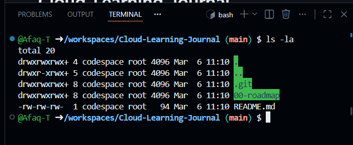
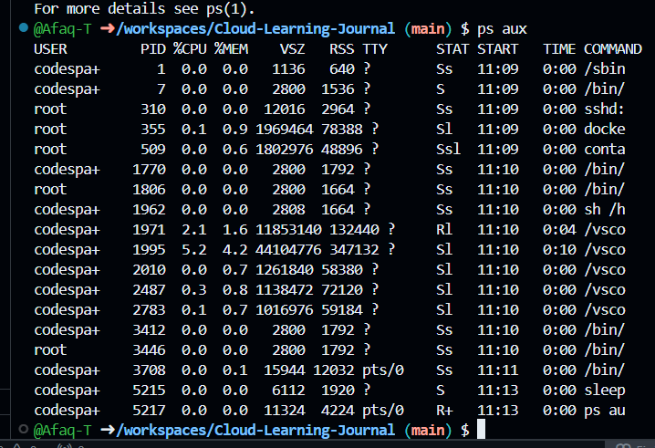
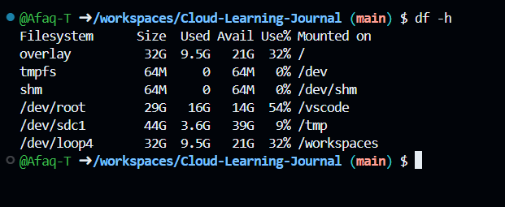
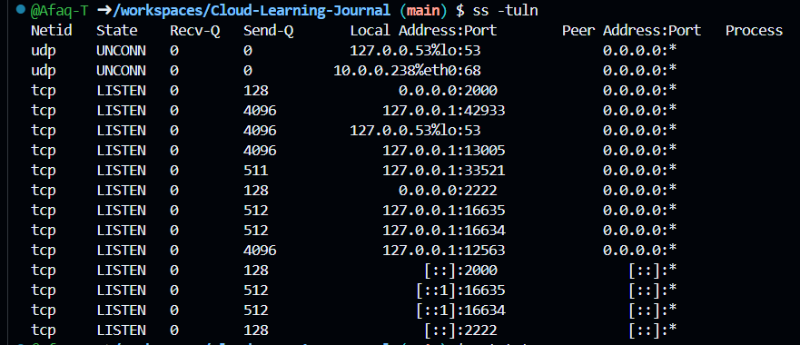
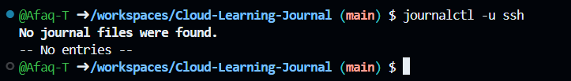

# Linux Basics – My Learning Journey

This page summarizes what I learned about Linux during Week 2 of my cloud and networking roadmap.  
I practiced all these commands in a GitHub Codespace (Ubuntu environment).

---

## 🔧 Key Linux Commands I Learned

### Navigation & File Management
| Command | Example | What it does |
|--------|---------|--------------|
| `pwd` | `pwd` | Prints the current working directory (where you are in the filesystem). |
| `ls -la` | `ls -la` | Lists all files (including hidden) with detailed permissions, owner, group, size. |
| `cd` | `cd /var/log` | Changes directory to the specified path. |
| `mkdir` | `mkdir ~/lab-week2` | Creates a new directory. |
| `touch` | `touch test.txt` | Creates an empty file. |
| `cp` | `cp file1.txt file2.txt` | Copies a file. |
| `mv` | `mv old.txt new.txt` | Renames or moves a file. |
| `rm` | `rm old.log` | Deletes a file. |
| `cat` | `cat /etc/os-release` | Displays the entire contents of a file. |
| `head` | `head -20 /var/log/syslog` | Shows the first 20 lines of a file. |
| `tail -f` | `tail -f /var/log/syslog` | Follows a log file in real time (press Ctrl+C to stop). |

### Permissions & Users
| Command | Example | What it does |
|--------|---------|--------------|
| `chmod` | `chmod 755 script.sh` | Changes file permissions (owner=rwx, group=rx, others=rx). |
| `chmod +x` | `chmod +x script.sh` | Makes a file executable. |
| `whoami` | `whoami` | Shows your current username. |
| `id` | `id` | Displays your user ID and group memberships. |
| `sudo` | `sudo apt update` | Runs a command with superuser (administrator) privileges. |

### System Information & Processes
| Command | Example | What it does |
|--------|---------|--------------|
| `df -h` | `df -h` | Shows disk space usage in human‑readable format (GB, MB). |
| `free -h` | `free -h` | Displays memory (RAM) usage. |
| `uptime` | `uptime` | Tells how long the system has been running. |
| `ps aux` | `ps aux` | Lists all running processes with details. |
| `top` | `top` | Live view of system processes (press `q` to quit). |
| `kill` | `kill 1234` | Stops a process by its PID (use `-9` to force). |

### Networking
| Command | Example | What it does |
|--------|---------|--------------|
| `ss -tuln` | `ss -tuln` | Lists all listening ports (TCP/UDP, numeric). |
| `curl -I` | `curl -I https://github.com` | Fetches HTTP headers from a URL. |
| `dig` | `dig google.com` | Performs a DNS lookup (shows IP address). |
| `ping -c 3` | `ping -c 3 8.8.8.8` | Tests connectivity with 3 packets. |
| `ip addr` | `ip addr` | Shows network interfaces and IP addresses. |

### Logs & Troubleshooting
| Command | Example | What it does |
|--------|---------|--------------|
| `journalctl -u` | `journalctl -u ssh` | Views logs for a specific system service. |
| `grep` | `grep error /var/log/syslog` | Searches for a pattern inside a file. |
| `systemctl status` | `systemctl status nginx` | Checks if a service is running. |
| `systemctl restart` | `systemctl restart nginx` | Restarts a service. |
| `du -sh` | `du -sh /var/log/*` | Shows disk usage of files/folders in human‑readable format. |

---

## 🧪 Troubleshooting Scenarios (with commands)

1. **A service is down**  
   `systemctl status nginx` → `journalctl -u nginx` → `sudo systemctl restart nginx` → check config in `/etc/nginx/`.

2. **A port is not listening**  
   `ss -tuln | grep 8080` → if nothing, service not running or wrong port.

3. **Disk is full**  
   `df -h` → `du -sh /var/log/* | sort -h` → clean old logs.

4. **Permission denied**  
   `ls -la file` → check owner/group → use `sudo` or `chmod`/`chown`.

5. **Can't install packages**  
   `sudo apt update` → check internet → verify `/etc/apt/sources.list`.

6. **High CPU usage**  
   `top` → note PID → `ps aux --sort=-%cpu | head` → `kill <PID>`.

## Screenshots from My Lab

Below are examples of commands I ran in my Codespace terminal.

### ls -la showing file permissions

### ps aux – all running processes

### df -h – disk space usage

### ss -tuln – listening ports

### journalctl -u ssh – logs for SSH service

## 💡 What I Learned

- Linux is everywhere – from servers to cloud VMs.
- The filesystem is a tree starting at `/`.
- Everything is a file (even devices!).
- Permissions are critical: owner/group/others with read/write/execute.
- `sudo` gives you temporary admin power.
- `systemctl` and `journalctl` are your friends for managing services and logs.
- `grep`, `ps`, `top`, `df`, `du` are essential for daily troubleshooting.
- Networking commands like `ss`, `ping`, `dig`, `curl` help diagnose connectivity.

---

I'm now comfortable navigating Linux, checking system health, and troubleshooting common issues – skills I'll use every day as a cloud or networking support engineer.
